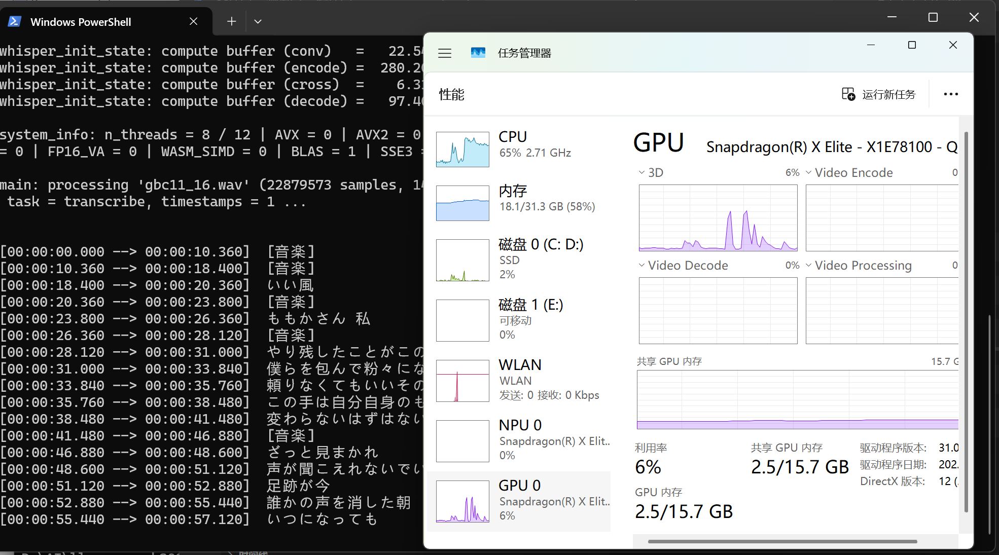

# Introduction
This repo is for prebuilt binaries of [whisper.cpp](https://github.com/ggerganov/whisper.cpp/commit/08981d1bacbe494ff1c943af6c577c669a2d9f4d) on Windows ARM64 with GPU acceleration.  
Vulkan version can run on WOA, however, when model are transferred to GPU, the app will down.  
Install [MSVC runtime](https://aka.ms/vs/17/release/vc_redist.x64.exe) first.
# Screenshots

